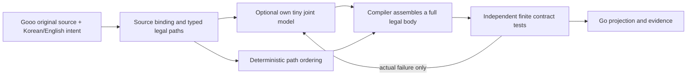

# Own Gooo joint path models: 2026-10-02

## What was built

Six fresh own models rank legal Gooo structural paths from the compiler's typed
source facts and complete Korean/English intent. No pretrained, Laya or earlier
own-model weights were inherited. Independent models predict two choices with
separate calls; the joint model predicts the probability of each complete mask
with one call. A mask chooses the reference, operand, assignment, predicate,
branch or statement schedule fragments already admitted by the typed plan.

This is bounded metaprogramming judgment. The compiler still creates executable
Go from typed fragments and validates them. Tests are excluded from initial
model input; subsequent actual failure receipts may rank unattempted masks.
A disconnected model uses deterministic enumeration. Oversized inputs and
unsupported joint decision counts decline before inference, without truncation.

The original [protocol](joint-path-composition-preregistration-20261002.md) was
committed before implementation, targets or training. The intended scale
expression was found constant before any new fixture was built. A separate
[prefixture amendment](joint-path-composition-prefixture-amendment-20261002.md)
corrected it to `2+((2c+1)%5)`; both byte digests remain frozen.

## Data and controls

| Composition | Interacting choices |
|---|---|
| assignment_reference | Mutated local and returned reference |
| operand_assignment | Difference operand order and assignment target |
| branch_reference | Conditional arms and subsequent reference |
| predicate_assignment | Comparison direction and assignment target |
| schedule_operand | Dependent statement order and final difference |
| schedule_branch | Statement placement and conditional arm order |

Each composition has 48 parameter configurations, four goals, two languages
and four enumerable masks. Parameters 0–31 train, 32–39 calibrate, 40–47 develop.
This gives 1,152 program contract groups and 2,304 bilingual function views;
language/configuration/goal variants are not distinct authored intentions.
Templates are shared across splits, so this does not measure unseen wording.

Every full target is reconstructed by ordinary Go int64 wrap arithmetic over
16 ordered inputs, including integer extremes, branch boundaries and retained
duplicates. All passing masks share target mass; ties are not invented errors.
Exactly 192 function views have product-marginal target mass outside the full
passing-mask target, demonstrating why joint representation is useful. This is
a property of the oracle target, not evidence that the learned joint model
has solved that correlation. Single inputs also contain conflicting targets;
eight of 576 distinct joint inputs have conflicting full targets.

Source collection made 2,304 real calls to clean compiler main
`f4813dc6251037767c8cff7295ccfdab2b044ff2`, with SDK v0.2.11. It exported 4,608
decision rows, made zero predictions and performed no candidate tests. Median
export child time was 6.064 ms, p95 6.785 ms; these are not model inference times.
Dataset SHA256: `2d1c9888a648d590e77253666b6e5ec848d375e47a3c99daf29dbde8bcbc7383`.

The independent architecture is 256/48/8 (12,728 parameters); joint is 512/24/4
(12,412). Both first matrices have 12,288 weights, but hidden width and output
head differ. This comparison cannot isolate loss function alone. Each arm made
120 FP32 and 120 QAT optimizer updates; PTQ made zero, for 480 total. QAT starts
its own fresh FP32 checkpoint. Seeds are 20261025/20261026. Only calibration
selects checkpoints, temperatures and the deployment candidate, before any
development session. All six variants are retained, including regressions.

Actual offline MPS training loops totalled 1.958 seconds, excluding process
startup, data preparation and export. Sampled MPS allocation peaked at 4,184,320
bytes and driver allocation at 53,166,080 bytes. Process lifetime peak RSS was
535,117,824 bytes. GPU utilization and causal host CPU delta were not measured.

## Go SDK results

Each cell below contains 384 development function views and 6,144 ordered cases.
Completeness means all 16 cases for a function, not a single passing case.

| Policy | Complete initially | Extra candidates | Actual predictions | Complete after budgets 1/2/3/4 |
|---|---:|---:|---:|---|
| disconnected | 112 | 520 | 0 | 112 / 216 / 304 / 384 |
| independent FP32 | 124 | 448 | 1,447 | 124 / 254 / 326 / 384 |
| independent PTQ | 108 | 479 | 1,470 | 108 / 239 / 326 / 384 |
| independent QAT | 120 | 455 | 1,453 | 120 / 251 / 326 / 384 |
| joint FP32 | 128 | 455 | 777 | 128 / 247 / 322 / 384 |
| joint PTQ | 128 | 485 | 808 | 128 / 216 / 323 / 384 |
| joint QAT | 114 | 469 | 792 | 114 / 246 / 323 / 384 |

Joint FP32 makes 46.30% fewer predictions than independent FP32 but requires
seven more extra candidates (1.56%). First complete functions are 33.33% versus
32.29%. Joint representation reduces calls here; it does not dominate assembly
cost or learned target probability. Average probability mass outside the full
target is 0.70575 for joint FP32 versus 0.70374 for independent FP32. Calibration
therefore selects **independent FP32**, with 400 extras versus joint FP32's 435.
There is no automatic default-model promotion.

Bilingual initial mask disagreement is 180/192 pairs for joint FP32, 182/192
for independent FP32 and 24/192 for joint PTQ. Lower disagreement can mean the
same wrong mask. PTQ's agreement improvement did not improve its candidate cost.

All seven arms reach finite 100% by four candidates, including disconnected
enumeration. This is evidence for bounded continuation, not universal semantic
correctness. The Go auditor reconstructs 5,376 captured SDK sessions, all hashes,
model pins, receipt chains, full probabilities, arithmetic, bilingual pairs and
the calibration-only selector. Recorded actual predictions across parity,
allocation/timing probes and both splits total 25,471. Audit adds zero calls.

| Runtime | Warm time per call | FP32 file | Ternary file | Ternary resident tensors + scales | Workspace |
|---|---:|---:|---:|---:|---:|
| independent | 8.93 µs FP / 9.94–10.04 µs ternary | 50,912 B | 2,759 B | 12,896 + 8 B | 1,248 B |
| joint | 10.69 µs FP / 10.59–10.65 µs ternary | 49,648 B | 2,590 B | 12,496 + 8 B | 2,160 B |

Each warm probe uses 1,001 predictions and a separate 1,001-call allocation
probe. All six report zero heap allocations per valid `PredictInto` call.
These measurements exclude model loading, context construction and sessions.
Ternary matrices pack five trits per byte (1.6 storage bits, theoretical 1.585)
and decode to int8 arrays for execution. Whole-process RAM is separate.
Go/offline export parity uses 192 real calls and maximum error below 1e-6.

## Native adoption and public evidence

SDK v0.2.12-experimental is released with source provenance, strict joint ABI,
request-owned workspaces, bounded loading and atomic/cancellable feedback.
Compiler feature PR [1137](https://github.com/kimjooyoon/meta-ontology-go/pull/1137)
adds explicit joint model dispatch after original source binding. Targeted tests,
race tests, vet and billing semantic checks pass locally. Full macOS tests have
the six existing failures in four filesystem-related packages; canonical Linux
CI remains authoritative. Initial CI found stale v0.2.11 checksums; the patch
removes them and repeats the exact-head CI.

Native main promotion and the planned 192-call actual compiled-Go audit are
pending. Their final evidence must replace this paragraph before public HF
packaging. Selected/reference duplicate the same calibrated model and must be
reported as replays. Public packaging retains both frozen documents, all six
models, raw source/curriculum/SDK/native evidence and six PROV-O chains; the
publication verifier uses anonymous immutable byte and ZIP CRC/SHA checks.

## Next own-model direction

1. Expand intent facts to distinguish the eight conflicting joint targets,
   preserving original source and complete intent. Measure representation loss
   separately from prediction mistakes.
2. Preregister variable-arity heads or pairwise factors for 3+ choices. Record
   total inference calls, candidate tests and search exhaustion; a four-way head
   cannot represent arbitrary decision counts.
3. Add nested branches, loop bounds, typed literal/variable assignments and
   typed predicate construction. Keep lawful source-bound fragments explicit
   and use ordinary independent Go oracles with adversarial boundary inputs.
4. Train observed-failure continuation data separately. Current training uses
   initial inputs only even though the runtime supports actual feedback; do not
   label runtime feedback success as feedback-trained competence.
5. Compare across fresh seeds and independently authored Korean/English intent
   groups before claiming transfer. Optimize total assembly time and completeness
   curves, rather than making first-shot accuracy the sole objective.

No new human review or Guardian gate is introduced. The model proposes lawful
path order, compiler evidence measures behavior, and disconnected operation
continues deterministically.
