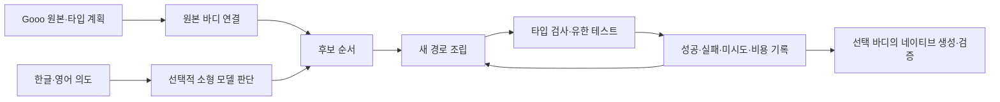

# Gooo 판단과 부분 구성 원칙

목표는 자연어 한 문장에서 완성 코드를 한 번에 맞히는 것이 아니다.
한글·영어 의도를 Gooo의 제한된 구조 후보로 판단하고, 조립 가능한 부분과
부족한 부분을 계속 관찰하는 것이다. 작은 모델은 조건·변수 참조·대입 대상·
분기 배치·선언 순서의 후보를 판단한다. Gooo의 타입 구조와 원본 의미가
조립 범위를 정하고, 테스트는 선언된 기능 중 만족한 부분을 기록한다.

## 현재 구현

- 원본 Gooo 바디와 계획의 기본 바디를 먼저 연결한다.
- 모델이 있으면 한글·영어 의도를 입력으로 구조 후보의 순서를 한 번 판단한다.
- 새로운 후보를 제한된 개수씩 조립하고 타입 검사·유한 테스트를 수행한다.
- 이미 시도한 후보는 다시 시도하지 않는다. 선택한 바디와 실패·미시도를 남긴다.
- 모델이 없으면 선언된 기본값을 기준으로 결정론적으로 진행한다.
- 네이티브 컴파일러는 최종 바디를 한 번 생성하고 타입·동일 재생·해석기와의
  일치를 검증한다. 연구용 CLI는 단계별 관찰을 출력할 수 있다.

현재 테스트 결과는 같은 세션의 최선 후보 선택에 사용한다. 연구용 API와 CLI는
[선택적 실패 요약 재판단](feedback-path-judgment.md)을 지원한다. 같은 모델에
관찰된 실패를 전달하고 미시도 경로의 순서만 바꾼다. 공개 Go SDK
`v0.2.4-experimental`에 이 선택적 기능과 입력 표현 거절의 계속 처리를 공개했다.
기존 연결의 [실제 측정](native-feedback-results.md)과
[긴 입력의 계속 구성 비교](continued-judgment-results.md)를 구분한다. 기본 경로는 초기 판단만
사용하며, 온라인 학습은 구현하지 않았다. 계획·
모델·테스트·시드가 바뀌면 새 세션을 시작한다. 모델은 일반 코드 생성 LLM이
아니며, 자유로운 자연어 전체를 임의의 Gooo 프로그램으로 변환하지 않는다.

## 완전성 기록

| 기록 | 의미 |
| --- | --- |
| 바디 변환 완전성 | 선택한 바디의 허용된 구조를 끝까지 변환했는가 |
| 유한 기능 완전성 | 선언한 테스트에서 몇 개를 만족했는가 |
| 구조 선택 | 어떤 조건·참조·대입·분기·순서를 선택했는가 |
| 탐색 범위 | 선언·시도·타입 거부·미시도 경로가 몇 개인가 |
| 판단 보류 | 모델 보류·입력 표현 거절이 몇 회이며 추가 추론 없이 계속했는가 |
| 작업 비용 | 모델 판단 수·후보 시도 수·시간·CPU 시간·메모리 |
| 근거 연결 | 원본·계획·모델·테스트·관찰의 해시 연결 |

바디 변환이 100%여도 기능 테스트는 6/7일 수 있다. 테스트에 없는 자연어
의도는 UNKNOWN으로 취급한다. 서로 다른 의미의 백분율을 하나의 정답률로
합치지 않는다. 미시도가 남으면 해당 경로를 다음 단계에서 탐색할 수 있고,
선언된 경로를 모두 소진해도 실패가 남으면 계획이나 기대값을 바꾸는 새 작업이
필요하다. 그 변경은 기존 관찰을 덮어쓰지 않는다.

실패 요약을 붙인 입력이 512바이트를 초과하면 원본 의도를 자르지 않고
입력·의도의 해시와 거절한 바이트 수를 기록한다. 이 경우 추가 판단은 0회이며
남은 경로의 순서와 최선 바디를 유지해 조립을 계속한다. 같은 배치의 반복
재판단은 허용하지 않고 라운드 예산을 소비한다. 원본·모델 오류나 취소까지
이 예외로 통과시키지는 않는다. 이는 표현 한계 때문에 이미 구성된 유효한
부분 바디가 버려지는 일을 줄이는 구현이다.

## PROV-O 관점

원본·의도·계획·모델·테스트·후보 바디는 각각 근거 대상이다. 판단·조립·검증은
서로 다른 작업이다. 관찰의 이전 해시는 이 작업의 계보를 연결한다. 현재
해시 연결은 PROV-O의 Entity/Activity 관계로 해석 가능한 관찰 계보이며,
RDF로 수용된 사실이나 의미 상태를 수정할 권한을 부여하지 않는다.

모델 출력은 후보 제안으로 남긴다. 원본 의미를 변경하려면 검증된 변경과 그
근거가 있어야 한다. CI는 제출된 소스의 기계 검증을 제공한다. Guardian과
사람의 필수 리뷰를 판단 입력으로 되돌리지 않는다.

## 공개와 측정

실행 전 조건·모델·예산을 고정하고 실제 성공·부분·실패를 공개한다. 표현
한계, 학습하지 않은 반복 실험, 테스트 선택과 평가의 겹침도 남긴다. 반복·
언어 번역·양자화 모델 비교는 별개의 실험 아이디어 수를 부풀리지 않는다.
공개 파일은 합성 의도와 허용 목록으로 한정하고 자격 증명·호스트 경로를
검사한다. 이전 GitHub 기록과 Hugging Face 모델 판본을 보존한다.

이번 288회 네이티브 실행은 모델 재학습이나 Laya 호출 없이 실제 소형 모델을
사용한 개발 실험이다. 같은 의도의 32개 비교 조건이며 독립적인 32개 아이디어가
아니다. 단계별 탐색이 중복 작업을 줄였다는 근거는 있지만, 일반 자연어 성능을
개선했다는 근거는 제공하지 않는다.
